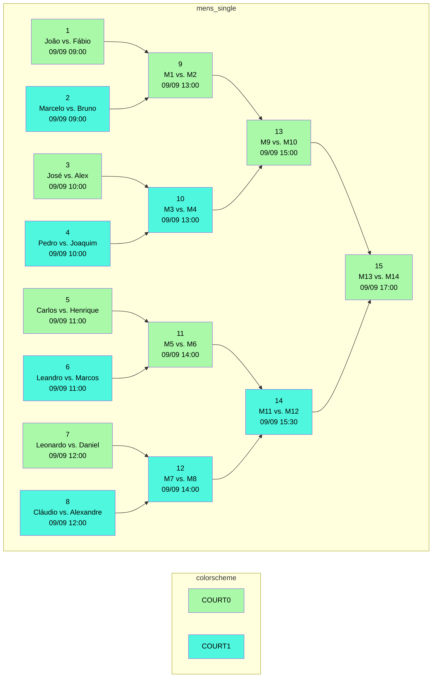

# Sports Manager Gem

The `sports-manager` gem is a powerful tool designed to generate and manage tournament schedules. It handles complex scheduling tasks, considering various constraints such as court availability, game length, rest breaks, and participant availability. Under the hood, it leverages the [`csp-resolver`](https://github.com/Rebase-BR/csp-resolver) gem to solve these complex Constraint Satisfaction Problems (CSPs).

## Getting Started

### Requirements

- Ruby >= 2.5.8

### Installing

You can install using the following command:

```bash
gem install "sports-manager"
```

Then install it:

```bash
$ bundle install
```

## Usage

### Setting Up a Tournament

To set up a tournament, you need to provide a configuration hash that defines all the necessary parameters:

```ruby
require 'sports-manager'

SportsManager::TournamentGenerator.new(format: :cli)
  .add_days(
    {
      '2023-09-09': { start: 9, end: 20 },
      '2023-09-10': { start: 9, end: 13 }
    }
  )
  .add_courts(2)
  .add_game_length(60)
  .add_rest_break(30)
  .set_single_day_matches(false)
  .add_subscriptions(
    {
      mens_single: [
        { id: 1, name: 'João' },      { id: 2, name: 'Marcelo' },
        { id: 3, name: 'José' },      { id: 4, name: 'Pedro' },
        { id: 5, name: 'Carlos' },    { id: 6, name: 'Leandro' },
        { id: 7, name: 'Leonardo' },  { id: 8, name: 'Cláudio' },
        { id: 9, name: 'Alexandre' }, { id: 10, name: 'Daniel' },
        { id: 11, name: 'Marcos' },   { id: 12, name: 'Henrique' },
        { id: 13, name: 'Joaquim' },  { id: 14, name: 'Alex' },
        { id: 15, name: 'Bruno' },    { id: 16, name: 'Fábio' }
      ]
    }
  )
  .add_matches(
    {
      mens_single: [
        [1, 16],
        [2, 15],
        [3, 14],
        [4, 13],
        [5, 12],
        [6, 11],
        [7, 10],
        [8, 9]
      ]
    }
  )
  .call
```

#### Configuration Parameters

- `when`: A hash of dates and their corresponding time slots.
- `courts`: Number of available courts.
- `game_length`: Duration of each game in minutes.
- `rest_break`: Rest time between games in minutes.
- `single_day_matches`: Boolean indicating if all matches should be on the same day.
- `subscriptions`: Players or teams participating in each category.
- `matches`: First matchups for each category.

### Running Example Tournaments

The gem comes with predefined example tournaments:

```ruby
solution = SportsManager::TournamentGenerator.example(:simple)
```

### Output Formats

You can choose different output formats:

```ruby
# CLI format (default)
solution = SportsManager::TournamentGenerator.call(params, format: :cli)

# Mermaid format (for visual diagrams)
solution = SportsManager::TournamentGenerator.call(params, format: :mermaid)
```
#### Output examples

```ruby
SportsManager::TournamentGenerator.new(format: :cli)
  .add_days(
    {
      '2023-09-09': { start: 9, end: 20 },
      '2023-09-10': { start: 9, end: 13 }
    }
  )
  .add_courts(2)
  .add_game_length(60)
  .add_rest_break(30)
  .set_single_day_matches(false)
  .add_subscriptions(
    {
      mens_single: [
        { id: 1, name: 'João' },      { id: 2, name: 'Marcelo' },
        { id: 3, name: 'José' },      { id: 4, name: 'Pedro' },
        { id: 5, name: 'Carlos' },    { id: 6, name: 'Leandro' },
        { id: 7, name: 'Leonardo' },  { id: 8, name: 'Cláudio' },
        { id: 9, name: 'Alexandre' }, { id: 10, name: 'Daniel' },
        { id: 11, name: 'Marcos' },   { id: 12, name: 'Henrique' },
        { id: 13, name: 'Joaquim' },  { id: 14, name: 'Alex' },
        { id: 15, name: 'Bruno' },    { id: 16, name: 'Fábio' }
      ]
    }
  )
  .add_matches(
    {
      mens_single: [
        [1, 16],
        [2, 15],
        [3, 14],
        [4, 13],
        [5, 12],
        [6, 11],
        [7, 10],
        [8, 9]
      ]
    }
  )
  .call
```
```bash
Tournament Timetable:

Solution 1
 category   | id | round |     participants      | court |      time     
------------|----|-------|-----------------------|-------|---------------
mens_single | 1  | 0     | João vs. Fábio        | 0     | 09/09 at 09:00
mens_single | 2  | 0     | Marcelo vs. Bruno     | 1     | 09/09 at 09:00
mens_single | 3  | 0     | José vs. Alex         | 0     | 09/09 at 10:00
mens_single | 4  | 0     | Pedro vs. Joaquim     | 1     | 09/09 at 10:00
mens_single | 5  | 0     | Carlos vs. Henrique   | 0     | 09/09 at 11:00
mens_single | 6  | 0     | Leandro vs. Marcos    | 1     | 09/09 at 11:00
mens_single | 7  | 0     | Leonardo vs. Daniel   | 0     | 09/09 at 12:00
mens_single | 8  | 0     | Cláudio vs. Alexandre | 1     | 09/09 at 12:00
mens_single | 9  | 1     | M1 vs. M2             | 0     | 09/09 at 13:00
mens_single | 10 | 1     | M3 vs. M4             | 1     | 09/09 at 13:00
mens_single | 11 | 1     | M5 vs. M6             | 0     | 09/09 at 14:00
mens_single | 12 | 1     | M7 vs. M8             | 1     | 09/09 at 14:00
mens_single | 13 | 2     | M9 vs. M10            | 0     | 09/09 at 15:00
mens_single | 14 | 2     | M11 vs. M12           | 1     | 09/09 at 15:30
mens_single | 15 | 2     | M13 vs. M14           | 0     | 09/09 at 17:00

Total solutions: 1
```
```ruby
SportsManager::TournamentGenerator.new(format: :mermaid)
  .add_days(
    {
      '2023-09-09': { start: 9, end: 20 },
      '2023-09-10': { start: 9, end: 13 }
    }
  )
  .add_courts(2)
  .add_game_length(60)
  .add_rest_break(30)
  .set_single_day_matches(false)
  .add_subscriptions(
    {
      mens_single: [
        { id: 1, name: 'João' },      { id: 2, name: 'Marcelo' },
        { id: 3, name: 'José' },      { id: 4, name: 'Pedro' },
        { id: 5, name: 'Carlos' },    { id: 6, name: 'Leandro' },
        { id: 7, name: 'Leonardo' },  { id: 8, name: 'Cláudio' },
        { id: 9, name: 'Alexandre' }, { id: 10, name: 'Daniel' },
        { id: 11, name: 'Marcos' },   { id: 12, name: 'Henrique' },
        { id: 13, name: 'Joaquim' },  { id: 14, name: 'Alex' },
        { id: 15, name: 'Bruno' },    { id: 16, name: 'Fábio' }
      ]
    }
  )
  .add_matches(
    {
      mens_single: [
        [1, 16],
        [2, 15],
        [3, 14],
        [4, 13],
        [5, 12],
        [6, 11],
        [7, 10],
        [8, 9]
      ]
    }
  )
  .call
```
```bash
Solutions:
--------------------------------------------------------------------------------
Solutions 1
Gantt:
---
displayMode: compact
---
gantt
  title Tournament Schedule
  dateFormat DD/MM HH:mm
  axisFormat %H:%M
  tickInterval 1hour

  section 0
    MS M1: 09/09 09:00, 1h
    MS M3: 09/09 10:00, 1h
    MS M5: 09/09 11:00, 1h
    MS M7: 09/09 12:00, 1h
    MS M9: 09/09 13:00, 1h
    MS M11: 09/09 14:00, 1h
    MS M13: 09/09 15:00, 1h
    MS M15: 09/09 17:00, 1h
  section 1
    MS M2: 09/09 09:00, 1h
    MS M4: 09/09 10:00, 1h
    MS M6: 09/09 11:00, 1h
    MS M8: 09/09 12:00, 1h
    MS M10: 09/09 13:00, 1h
    MS M12: 09/09 14:00, 1h
    MS M14: 09/09 15:30, 1h
Graph:
graph LR
classDef court0 fill:#A9F9A9, color:#000000
classDef court1 fill:#4FF7DE, color:#000000
subgraph colorscheme
  direction LR

  COURT0:::court0
  COURT1:::court1
end
subgraph mens_single
  direction LR

  mens_single_1[1\nJoão vs. Fábio\n09/09 09:00]:::court0
  mens_single_2[2\nMarcelo vs. Bruno\n09/09 09:00]:::court1
  mens_single_3[3\nJosé vs. Alex\n09/09 10:00]:::court0
  mens_single_4[4\nPedro vs. Joaquim\n09/09 10:00]:::court1
  mens_single_5[5\nCarlos vs. Henrique\n09/09 11:00]:::court0
  mens_single_6[6\nLeandro vs. Marcos\n09/09 11:00]:::court1
  mens_single_7[7\nLeonardo vs. Daniel\n09/09 12:00]:::court0
  mens_single_8[8\nCláudio vs. Alexandre\n09/09 12:00]:::court1
  mens_single_9[9\nM1 vs. M2\n09/09 13:00]:::court0
  mens_single_10[10\nM3 vs. M4\n09/09 13:00]:::court1
  mens_single_11[11\nM5 vs. M6\n09/09 14:00]:::court0
  mens_single_12[12\nM7 vs. M8\n09/09 14:00]:::court1
  mens_single_13[13\nM9 vs. M10\n09/09 15:00]:::court0
  mens_single_14[14\nM11 vs. M12\n09/09 15:30]:::court1
  mens_single_15[15\nM13 vs. M14\n09/09 17:00]:::court0
  mens_single_1 --> mens_single_9
  mens_single_2 --> mens_single_9
  mens_single_3 --> mens_single_10
  mens_single_4 --> mens_single_10
  mens_single_5 --> mens_single_11
  mens_single_6 --> mens_single_11
  mens_single_7 --> mens_single_12
  mens_single_8 --> mens_single_12
  mens_single_9 --> mens_single_13
  mens_single_10 --> mens_single_13
  mens_single_11 --> mens_single_14
  mens_single_12 --> mens_single_14
  mens_single_13 --> mens_single_15
  mens_single_14 --> mens_single_15
end
--------------------------------------------------------------------------------
Total solutions: 1
```


## Contributing

See our [CONTRIBUTING](./CONTRIBUTING.md) guidelines.

## Code of Conduct

We expect that everyone participating in any way with this project follows our [Code of Conduct](./CODE_OF_CONDUCT.md).

## License

This project is licensed under the [MIT License](MIT-LICENSE).